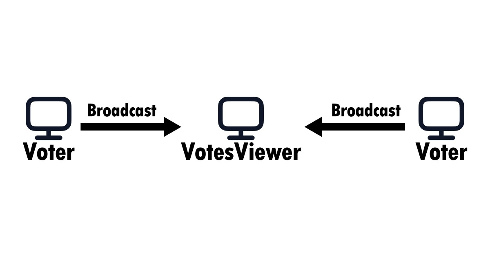

# Voting System

## Features

* Works without an Internet connection.
* UDP Broadcast communication.
* Real-time results.
* CSV export support.
* Multiple viewer support.
* Open-source code.

This repository contains the source code for a real-time voting system designed to operate within a private LAN environment, without requiring an Internet connection.

The system is divided into two applications:

* **Voter:** Runs on one or more computers to collect participants' votes. It periodically sends UDP broadcast packets through a user-selected port (default: `8999`). These packets are encrypted to prevent simple attacks; however, since the source code is open, this mechanism is not completely secure against more advanced attacks. For improved security, it is recommended to compile your own version using a custom secret key.

* **VotesViewer:** Intended to run on a single computer, although multiple devices can run it simultaneously. This application receives every packet sent by the **Voter** instances, organizes the data, and displays a real-time chart of the voting results. It is primarily designed to be projected on a screen.

## Setting Up the System

### Creating the Candidate List

All participating devices must share the same candidate list file. This file can be generated from the **Voter** application by navigating to:

**Edit candidates** → **Export**

The exported file can then be imported into any other instance of the system.

### Importing into **Voter**

**Edit candidates** → **Import**

### Importing into **VotesViewer**

Click the **Import** button located in the top menu.

*(If you cannot see the top menu, move your mouse cursor near the upper edge of the window to make it appear.)*

## Voting example

### Network Requirements

All devices must be connected to the same LAN network. Additionally, **every device must be configured to use the same communication port**.

For security reasons, it is recommended to use a private LAN network restricted to voting participants in order to reduce the risk of interference or packet injection attacks.

The system relies on UDP Broadcast communication, so you must ensure that all participating devices are able to send and receive broadcast packets.

## Ending the Voting Session

To finalize the voting session, go to the computer running **VotesViewer**, open the top menu, and click **Save**. This will generate a `.csv` file containing the voting results.

To end the voting session on computers running **Voter**, press `Ctrl + F`. You can also export the results from that individual device to a `.csv` file.